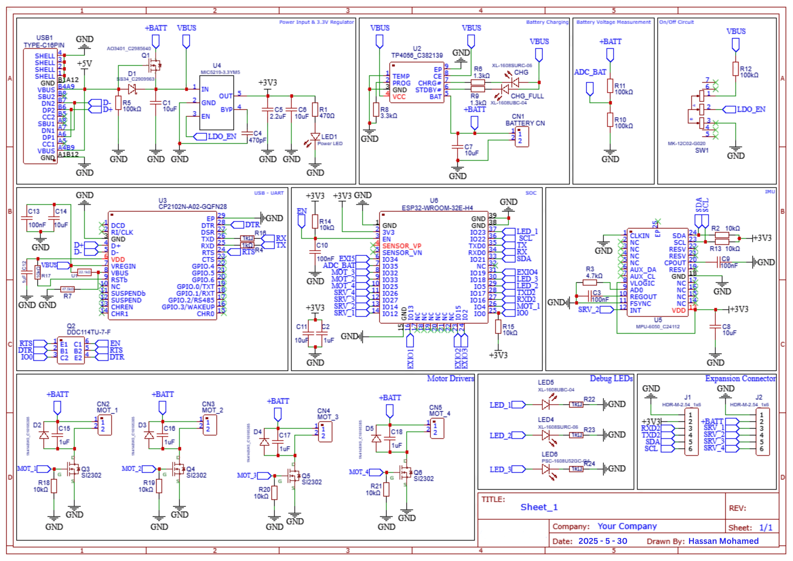
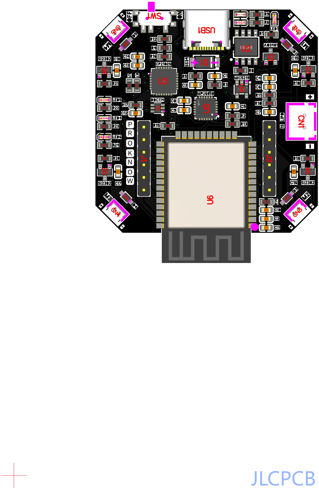
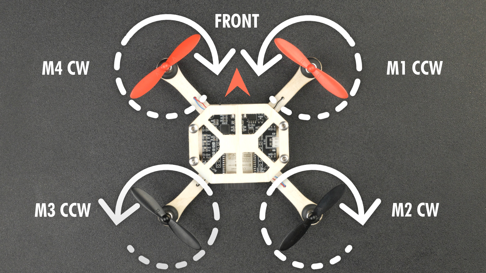

# PCB Drone Project Journal

**Author:** Hassan Mohamed
**Project Start Date:** May 29, 2025
**Total Time Spent:** 8 hours

---

## May 29, 2025

**Time Spent:** 3 hours
**Activities:**
- Installed and set up **KiCad**
- Started designing the schematic for the circuit
- Researched microcontroller options (leaning towards STM32 or ATmega328P)

**Media:**

---
---

## June 2, 2025

**Time Spent:** 2 hours
**Activities:**
- Started component footprint placement on PCB
- Ensured proper sizing for ESC pads and XT60 connector

**Media:**

---
---

## June 8, 2025

**Time Spent:** 3 hours
**Activities:**
- Finalized PCB layout
- Ran DRC checks
- Generated Gerber files and prepared for JLCPCB order

**Media:**

---
---

## June 11, 2025

**The PCB arrived from the JLC**

---
